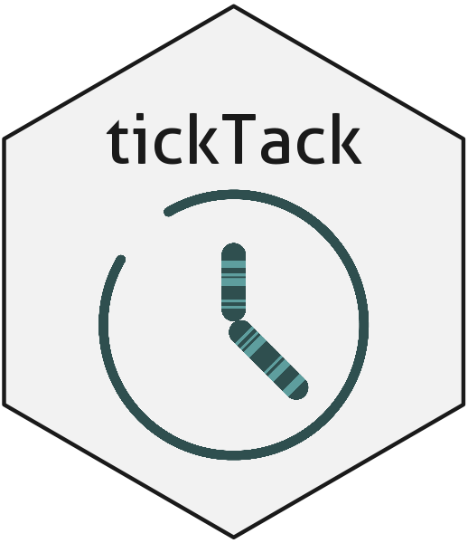

<!-- README.md is generated from README.Rmd. Please edit that file -->

<!-- badges: start -->

[](https://github.com/caravagnalab/tickTack/actions)

<!-- badges: end -->

# lineaGT <a href="caravagnalab.github.io/lineaGT"></a>

tickTack is a package to infer kinetic parameters of an evolving
population whose size is observed at discrete intervals of time. The
tool is able to

- time simple CNAs for each segment affected by them

- time CNAs in a hierarchical fashion, grouping together segments that
  most likely underwent a CNA concurrently

#### Help and support

## [](https://caravagnalab.github.io/tickTack)

## Installation

You can install the released version of `tickTack` from
[GitHub](https://github.com/) with:

``` r
# install.packages("devtools")
devtools::install_github("caravagnalab/tickTack")
```

------------------------------------------------------------------------

#### Copyright and contacts

Sara Cocomello, Giovanni Santacatterina, Giulio Caravagna. Cancer Data
Science (CDS) Laboratory, University of Trieste, Italy.

[](https://github.com/caravagnalab)
[](https://www.caravagnalab.org/)
