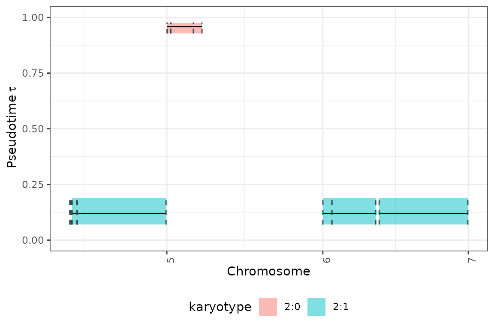

# 4. Timing Clonal Peaks in a hierarchical fashioin

The `_fit_h` function in the `tickTack` package estimates the timing of
`K` clonal binomial peaks in cancer genome sequencing data according to
which a clustering can be performed. This vignette describes the
functionality of the `fit_h` function, including input requirements,
output, and an example analysis using the
[`tickTack::pcawg_example_2`](https://caravagnalab.github.io/tickTack/reference/pcawg_example_2.md)
dataset.

## Overview of the `fit_h` Function

The `fit_h` function uses a hierarchical model to fit clonal binomial
peaks in sequencing data considering the grouping structure of the
chromosomes segments. It identifies segments of the genome with specific
karyotypes and mutations that meet the input criteria, then estimates
the timing of the groups of events and assign each segment to a clock.
The clock represents the pseudotime, where 0 is the moment the cancerous
population was born and 1 is the time of the most recent common ancestor
(MRCA) of the cells in the bulk sequencing sample.

### Key Parameters

- **`x`**: a CNAqc object with mutations, cna and metadata
- **`max_attempts`**: Number of times the variational inference is
  repeated to avoid local minima.
- **`INIT`**: Logical flag to pass some initialization values tothe
  variational inference, default is `TRURE`.
- **`tolerance`**: tolerance between two value of subsequent iterations
  of gradient ascent on elbo, default is `0.01`.
- **`possible_k`**: A character vector of possible karyotypes,
  defaulting to `c("2:1", "2:2", "2:0")`.
- **`alpha`**: Significance level, defaulting to `0.05`.
- **`min_mutations_number`**: Minimum number of mutations required for
  analysis, defaulting to `2`.
- **`n_components`**: If `0`, then the strategy to choose the
  \#components follows the default procedure, otherwise the inference is
  repeated for K equal up to a maximun of n_components.

### Output

The function returns a list containing:

1.  **`data`**: The data used to perform the inference after selecting
    the ones that respect the assumptions to be used in the model.
2.  **`draws_and_summary`**: List of 3 for each K the inference is
    performed with. Draws are available both for the clocks and for the
    weights Summary statistics for the estimated timing of clonal peaks.
3.  **`log_lik_matrix_list`**: Summary statistics for the estimated
    timing of clonal peaks.
4.  **`elbo_iterations`**: Summary statistics for the estimated timing
    of clonal peaks.

If no segments meet the criteria, the function returns `NULL`.

## Analyzing `tickTack::pcawg_example_2`

We will use the
[`tickTack::pcawg_example_2`](https://caravagnalab.github.io/tickTack/reference/pcawg_example_2.md)
dataset to demonstrate how to use the `fit_h` function.

### Input Data

The
[`tickTack::pcawg_example_2`](https://caravagnalab.github.io/tickTack/reference/pcawg_example_2.md)
dataset contains three components:

- **`mutations`**: Mutation data.
- **`cna`**: Copy number alterations (CNA).
- **`metadata`**: Sample metadata, including tumor purity.

Preview the data:

``` r
library(tickTack)
library(patchwork)
library(ggplot2)


# View example dataset components
mutations <- tickTack::pcawg_example_2$mutations
cna <- tickTack::pcawg_example_2$cna
metadata <- tickTack::pcawg_example_2$metadata

head(mutations)
```

    ## # A tibble: 6 × 45
    ##   chr      from      to ref   alt      DP    NV   VAF sample      NR Hugo_Symbol
    ##   <chr>   <dbl>   <dbl> <chr> <chr> <dbl> <dbl> <dbl> <chr>    <dbl> <chr>      
    ## 1 chr1  1018754 1018754 C     C        51    24 0.471 3b7810f…    27 C1orf159   
    ## 2 chr1  1107556 1107556 C     C        53    17 0.321 3b7810f…    36 TTLL10     
    ## 3 chr1  1127192 1127192 C     C        78    13 0.167 3b7810f…    65 TTLL10     
    ## 4 chr1  1255263 1255263 C     C        66    23 0.348 3b7810f…    43 CPSF3L     
    ## 5 chr1  1474126 1474126 C     C        68    17 0.25  3b7810f…    51 TMEM240    
    ## 6 chr1  1532289 1532289 G     G        39     6 0.154 3b7810f…    33 C1orf233   
    ## # ℹ 34 more variables: Strand <chr>, Variant_Classification <chr>,
    ## #   Variant_Type <chr>, Tumor_Seq_Allele2 <chr>, dbSNP_RS <chr>,
    ## #   dbSNP_Val_Status <chr>, Matched_Norm_Sample_Barcode <chr>,
    ## #   Genome_Change <chr>, ref_context <chr>, gc_content <dbl>,
    ## #   i_1000genomes_AF <dbl>, i_1000genomes_ID <chr>, i_Callers <chr>,
    ## #   i_GERM1000G <lgl>, i_GERMOVLP <lgl>, i_LOWSUPPORT <lgl>,
    ## #   i_NORMALPANEL <lgl>, i_NumCallers <dbl>, i_OXOGFAIL <lgl>, …

``` r
head(cna)
```

    ## # A tibble: 6 × 39
    ##   chr        from        to Major minor   CCF total_cn  star level methods_agree
    ##   <chr>     <dbl>     <dbl> <dbl> <dbl> <dbl>    <dbl> <dbl> <chr>         <dbl>
    ## 1 chr1      10001 121499999     1     1     1        2     3 a                 6
    ## 2 chr1  121500000 128899999     1     1     1        2     2 d                 4
    ## 3 chr1  128900000 247247500     1     1     1        2     3 a                 6
    ## 4 chr1  247247501 249250620     1     1     1        2     2 d                 4
    ## 5 chr2      66017  90499999     1     1     1        2     3 a                 6
    ## 6 chr2   90500000  96799999     1     1     1        2     3 a                 6
    ## # ℹ 29 more variables: absolute_broad_major_cn <dbl>,
    ## #   absolute_broad_minor_cn <dbl>, absolute_broad_het_error <dbl>,
    ## #   absolute_broad_cov_error <dbl>, aceseq_copy_number <dbl>,
    ## #   aceseq_minor_cn <dbl>, aceseq_major_cn <dbl>, battenberg_nMaj1_A <dbl>,
    ## #   battenberg_nMin1_A <dbl>, battenberg_frac1_A <dbl>,
    ## #   battenberg_nMaj2_A <dbl>, battenberg_nMin2_A <dbl>,
    ## #   battenberg_frac2_A <dbl>, battenberg_SDfrac_A <dbl>, …

``` r
metadata
```

    ## # A tibble: 1 × 6
    ##   sample                  purity ploidy purity_conf_mad wgd_status wgd_uncertain
    ##   <chr>                    <dbl>  <dbl>           <dbl> <chr>      <lgl>        
    ## 1 3b7810f7-f8ff-4d62-b76…  0.611   1.92           0.002 no_wgd     FALSE

### Running the `fit_h` function

We can run the `fit_h` function on the
[`tickTack::pcawg_example_2`](https://caravagnalab.github.io/tickTack/reference/pcawg_example_2.md)
data to infer the timing of clonal peaks

### Results

The `results` object that is returned together with the CNAqc input
object contains four components: `data`, `draws_and_summary`,
`log_lik_matrix_list` and `elbo_iterations`. In the `data` there are
both the `input_data` passed to the Stan model and the `accepted_cna`
segments that respect the selection conditions and are included in the
inference. The `draws_and_summary` part present an object for each
inference performed with the used number of components. Each of them is
named by the number of components `K` used for the inference so we can
access them as below.

``` r
# View results
fit$results_timing$data$accepted_cna
```

    ## # A tibble: 10 × 5
    ##    segment_original_indx segment_name            segment_id karyotype chr  
    ##                    <int> <chr>                        <dbl> <chr>     <chr>
    ##  1                    38 chr5_75225353_75780032           1 2:1       chr5 
    ##  2                    40 chr5_76857368_76998901           2 2:1       chr5 
    ##  3                    42 chr5_77822720_82754991           3 2:1       chr5 
    ##  4                    44 chr5_83468190_180689978          4 2:1       chr5 
    ##  5                    46 chr6_242501_4335355              5 2:0       chr6 
    ##  6                    48 chr6_4347801_29092265            6 2:0       chr6 
    ##  7                    50 chr6_29161839_38477499           7 2:0       chr6 
    ##  8                    54 chr7_65454_9937168               8 2:1       chr7 
    ##  9                    56 chr7_9946564_57999999            9 2:1       chr7 
    ## 10                    58 chr7_61700000_158817500         10 2:1       chr7

``` r
results <- fit$results_timing
```

### Interpreting the output

We can inspect the main output of interest to understand the timing of
clonal peaks. `results$draws_and_summary` contains: - **`draws`** the
draws from the approximate posterior distribution of the taus and
weights; - **`summary`** a summary with the main statistics of the
approximate posterior distributions; - **`summarized_results`**
represents the clock assignment, a tibble with the estimate of taus for
each segment with a copy number event that has been included in the
hierarchical inference

``` r
# View summary for a specific K, here K = 1
inference_with_1_component <- results$draws_and_summary[["1"]]
inference_with_5_component <- results$draws_and_summary[["5"]]

# View detailed summarized results for a specific K, here K = 1 and K = 5
inference_with_1_component$summarized_results
```

    ## # A tibble: 10 × 10
    ##    segment_original_indx segment_name      segment_id karyotype chr   clock_mean
    ##                    <int> <chr>                  <dbl> <chr>     <chr>      <dbl>
    ##  1                    38 chr5_75225353_75…          1 2:1       chr5       0.242
    ##  2                    40 chr5_76857368_76…          2 2:1       chr5       0.242
    ##  3                    42 chr5_77822720_82…          3 2:1       chr5       0.242
    ##  4                    44 chr5_83468190_18…          4 2:1       chr5       0.242
    ##  5                    46 chr6_242501_4335…          5 2:0       chr6       0.242
    ##  6                    48 chr6_4347801_290…          6 2:0       chr6       0.242
    ##  7                    50 chr6_29161839_38…          7 2:0       chr6       0.242
    ##  8                    54 chr7_65454_99371…          8 2:1       chr7       0.242
    ##  9                    56 chr7_9946564_579…          9 2:1       chr7       0.242
    ## 10                    58 chr7_61700000_15…         10 2:1       chr7       0.242
    ## # ℹ 4 more variables: clock_low <dbl>, clock_high <dbl>, alpha <dbl>,
    ## #   beta <dbl>

``` r
inference_with_5_component$summarized_results
```

    ## # A tibble: 10 × 10
    ##    segment_original_indx segment_name      segment_id karyotype chr   clock_mean
    ##                    <int> <chr>                  <dbl> <chr>     <chr>      <dbl>
    ##  1                    38 chr5_75225353_75…          1 2:1       chr5    0.368   
    ##  2                    40 chr5_76857368_76…          2 2:1       chr5    0.000612
    ##  3                    42 chr5_77822720_82…          3 2:1       chr5    0.0269  
    ##  4                    44 chr5_83468190_18…          4 2:1       chr5    0.0269  
    ##  5                    46 chr6_242501_4335…          5 2:0       chr6    0.955   
    ##  6                    48 chr6_4347801_290…          6 2:0       chr6    0.955   
    ##  7                    50 chr6_29161839_38…          7 2:0       chr6    0.955   
    ##  8                    54 chr7_65454_99371…          8 2:1       chr7    0.167   
    ##  9                    56 chr7_9946564_579…          9 2:1       chr7    0.167   
    ## 10                    58 chr7_61700000_15…         10 2:1       chr7    0.167   
    ## # ℹ 4 more variables: clock_low <dbl>, clock_high <dbl>, alpha <dbl>,
    ## #   beta <dbl>

### Obtain the best K with model_selection_h

W e can run the `model_selection_h` function to obtain the scores for
each inference performed with a different K and take the one with best
ICL score if the BIC score prefer 2 components instead of 1, otherwise
choose 1 as best K. The function takes as input the `results` and
`n_components` and outputs the `best_K` and the corresponding `best_fit`
together with the `model_selection_tibble` and the `entropy_list` used
to evaluate the ICL score.

``` r
results_model_selection <- tickTack::model_selection_h(results, n_components = 0)
```

    ## Warning: Some Pareto k diagnostic values are too high. See help('pareto-k-diagnostic') for details.
    ## Warning: Some Pareto k diagnostic values are too high. See help('pareto-k-diagnostic') for details.
    ## Warning: Some Pareto k diagnostic values are too high. See help('pareto-k-diagnostic') for details.
    ## Warning: Some Pareto k diagnostic values are too high. See help('pareto-k-diagnostic') for details.

``` r
best_K <- results_model_selection$best_K
model_selection_tibble <- results_model_selection$model_selection_tibble
```

## Visulizing the output

The results can be viewed is genome-wise perspective using the
[`tickTack::plot_timing_h`](https://caravagnalab.github.io/tickTack/reference/plot_timing_h.md)
function.

``` r
# fit$metadata = tibble(purity=fit$purity)
# fit$cna <- fit$cna%>%mutate(Major_2=Major,minor_2=minor)
library(dplyr)
```

    ## 
    ## Attaching package: 'dplyr'

    ## The following objects are masked from 'package:stats':
    ## 
    ##     filter, lag

    ## The following objects are masked from 'package:base':
    ## 
    ##     intersect, setdiff, setequal, union

``` r
fit$reference_genome <- "GRCh37"
fit$cna <- fit$cna%>%mutate(Major_2=Major,minor_2=minor)
plot_cnaqc(fit,add_mobster=F)
```

    ## Warning: Some Pareto k diagnostic values are too high. See help('pareto-k-diagnostic') for details.
    ## Warning: Some Pareto k diagnostic values are too high. See help('pareto-k-diagnostic') for details.
    ## Warning: Some Pareto k diagnostic values are too high. See help('pareto-k-diagnostic') for details.
    ## Warning: Some Pareto k diagnostic values are too high. See help('pareto-k-diagnostic') for details.

    ## ✔ Loading CNAqc, 'Copy Number Alteration quality check'. Support : <https://caravagn.github.io/CNAqc/>

    ## 

    ## ── CNAqc - CNA Quality Check ───────────────────────────────────────────────────

    ## ℹ Using reference genome coordinates for: GRCh37.

    ## ! Detected indels mutation (substitutions with >1 reference/alternative nucleotides).

    ## ✖ NA values in some of the required mutation columns, these will be removed.

    ## ✔ Fortified calls for 41400 somatic mutations: 36223 SNVs (87%) and 5177 indels.

    ## ℹ 2 subclonal CNAs detected in the data.

    ## ! Added segments length (in basepairs) to CNA segments.

    ## ✔ Fortified CNAs for 107 segments: 105 clonal and 2 subclonal.

    ## ✔ 39324 mutations mapped to clonal CNAs.

    ## Warning: Unknown or uninitialised column: `mutations`.

    ## ✔ 0 mutations mapped to subclonal CNAs.

    ## Warning: Using `size` aesthetic for lines was deprecated in ggplot2 3.4.0.
    ## ℹ Please use `linewidth` instead.
    ## ℹ The deprecated feature was likely used in the CNAqc package.
    ##   Please report the issue at <https://github.com/caravagnalab/CNAqc/issues>.
    ## This warning is displayed once per session.
    ## Call `lifecycle::last_lifecycle_warnings()` to see where this warning was
    ## generated.

    ## Warning: Removed 17 rows containing missing values or values outside the scale range
    ## (`geom_segment()`).



## Visualize distributions of draws from the approximate posterior

The approximate posterior distributions can be viewed using the
[`tickTack::plot_posterior_clocks_h`](https://caravagnalab.github.io/tickTack/reference/plot_posterior_clocks_h.md)
and
[`tickTack::plot_posterior_weights_h`](https://caravagnalab.github.io/tickTack/reference/plot_posterior_weights_h.md)
functions, that internally use functions from Bayesplot.

``` r
posterior_clocks <- tickTack::plot_posterior_clocks_h(results, 2)
```

    ## Scale for x is already present.
    ## Adding another scale for x, which will replace the existing scale.

``` r
posterior_weights <- tickTack::plot_posterior_weights_h(results, 2)
```


## Visualize the behavior of the ELBO during the inference

``` r
K = nrow(results_model_selection$model_selection_tibble)

p_elbo <- list()
for (i in 1:K){
  p_elbo[[i]] <- tickTack::plot_elbo_h(results$elbo_iterations[[i]]) + ggplot2::ggtitle(paste0("K = ", i))
}
p_elbo <- gridExtra::grid.arrange(grobs = p_elbo, ncol = 2)  #add global title
```


``` r
p_elbo
```

    ## TableGrob (3 x 2) "arrange": 5 grobs
    ##   z     cells    name           grob
    ## 1 1 (1-1,1-1) arrange gtable[layout]
    ## 2 2 (1-1,2-2) arrange gtable[layout]
    ## 3 3 (2-2,1-1) arrange gtable[layout]
    ## 4 4 (2-2,2-2) arrange gtable[layout]
    ## 5 5 (3-3,1-1) arrange gtable[layout]

## Visualize all the inference results for each K

``` r
plot_model_selection_inference <- list()
for (i in 1:K){
  plot_model_selection_inference[[i]] <- tickTack::plot_timing_h(results, i) + ggplot2::ggtitle(paste0("K = ", i))
}
plot_model_selection_inference <- gridExtra::grid.arrange(grobs = plot_model_selection_inference, ncol = 2) #add global title
```


``` r
plot_model_selection_inference
```

    ## TableGrob (3 x 2) "arrange": 5 grobs
    ##   z     cells    name           grob
    ## 1 1 (1-1,1-1) arrange gtable[layout]
    ## 2 2 (1-1,2-2) arrange gtable[layout]
    ## 3 3 (2-2,1-1) arrange gtable[layout]
    ## 4 4 (2-2,2-2) arrange gtable[layout]
    ## 5 5 (3-3,1-1) arrange gtable[layout]
