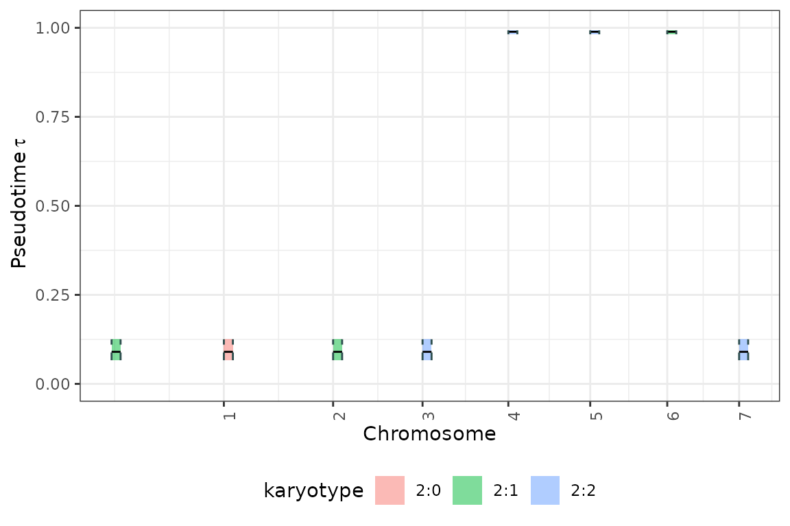
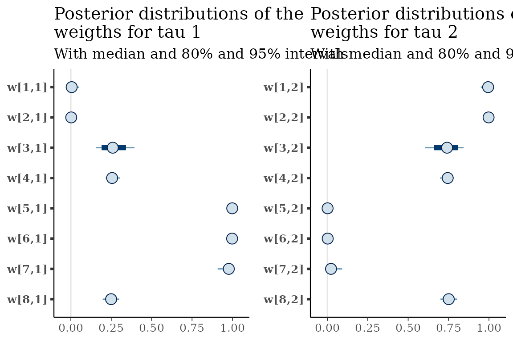
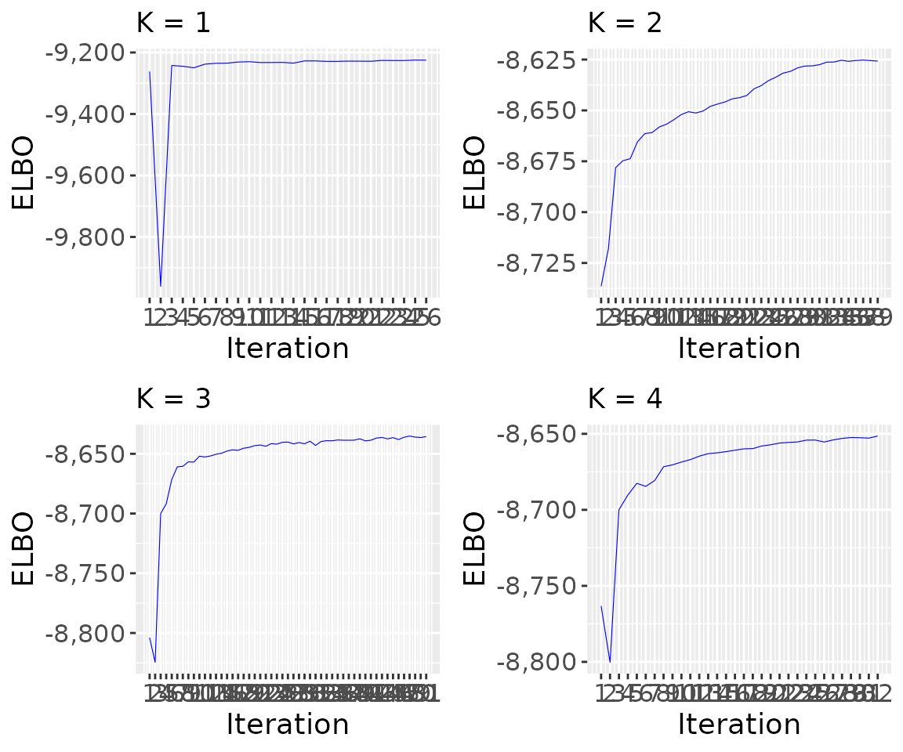

# 6. Simulate data

``` r
library(dplyr)
n_clocks=3
n_events=8
purity=0.9 
coverage=100 
epsilon=0.20 
seed = 123 
tolerance = 0.0001
max_attempts = 2
INIT = TRUE
min_mutations_number = 3


cat("coverage: ", coverage)

mu = 1e-4 # mutation rate
cat("mutation rate: ", mu)

w = 1e-2 # cell division rate
cat("cell division rate: ", w)

l = 2e7 # length of the segment
cat("length of the segment: ", l)

time_interval = 7
cat("time_interval: ", time_interval)


res_simulate <- tickTack::get_simulation_tickTack(number_clocks=n_clocks, 
                                               number_events=n_events, 
                                               purity=purity, 
                                               coverage=coverage, 
                                               epsilon=epsilon, 
                                               seed = seed)
  
data_simulation = as.data.frame(res_simulate$data_simulation) %>% mutate(chr=   1:length(res_simulate$data_simulation$taus))
x = res_simulate$x

df = x$cna %>% left_join(data_simulation)

# timing inference ticktack hierarchical

x <- tickTack::fit_h(x, max_attempts=max_attempts, INIT=INIT, tolerance = tolerance)


results_simulated <- x$results_timing
results_model_selection <- tickTack::model_selection_h(results_simulated)
```

    ## Warning: Some Pareto k diagnostic values are too high. See help('pareto-k-diagnostic') for details.
    ## Warning: Some Pareto k diagnostic values are too high. See help('pareto-k-diagnostic') for details.

``` r
best_K <- results_model_selection$best_K
```

``` r
data_simulation$taus
```

    ## [1] 0.1028646 0.1028646 0.4348927 0.4348927 0.9849570 0.9849570 0.9849570
    ## [8] 0.4348927

### Results

The `results` object that is returned together with the CNAqc input
object contains four components: `data`, `draws_and_summary`,
`log_lik_matrix_list` and `elbo_iterations`.

``` r
# View summary for a specific K, here K = 2
results <- x$results
```

### Interpreting the output

We can inspect the main output of interest to understand the timing of
clonal peaks. `results$draws_and_summary` contains: - **`draws`** the
draws from the approximate posterior distribution of the taus and
weights; - **`summary`** a summary with the main statistics of the
approximate posterior distributions; - **`summarized_results`**
represents the clock assignment, a tibble with the estimate of taus for
each segment with a copy number event that has been included in the
hierarchical inference

``` r
# View summary for a specific K, here K = 2
results$draws_and_summary[[2]]$summary
```

    ## # A tibble: 50 × 7
    ##    variable    mean  median      sd     mad       q5     q95
    ##    <chr>      <dbl>   <dbl>   <dbl>   <dbl>    <dbl>   <dbl>
    ##  1 tau[1]   0.0804  0.0794  0.0194  0.0192  0.0529   0.114  
    ##  2 tau[2]   0.988   0.989   0.00360 0.00318 0.982    0.993  
    ##  3 w[1,1]   0.986   0.990   0.0125  0.00778 0.962    0.997  
    ##  4 w[2,1]   0.995   0.996   0.00481 0.00295 0.985    0.999  
    ##  5 w[3,1]   0.736   0.738   0.0472  0.0509  0.657    0.805  
    ##  6 w[4,1]   0.755   0.757   0.0287  0.0276  0.705    0.800  
    ##  7 w[5,1]   0.00194 0.00105 0.00267 0.00101 0.000183 0.00685
    ##  8 w[6,1]   0.00517 0.00182 0.0113  0.00203 0.000188 0.0187 
    ##  9 w[7,1]   0.0253  0.0141  0.0341  0.0132  0.00228  0.0837 
    ## 10 w[8,1]   0.725   0.726   0.0268  0.0262  0.679    0.769  
    ## # ℹ 40 more rows

``` r
# View detailed summarized results for a specific K, here K = 2
results$draws_and_summary[[2]]$summarized_results
```

    ## # A tibble: 8 × 10
    ##   segment_original_indx segment_name segment_id karyotype   chr clock_mean
    ##                   <int> <chr>             <dbl> <chr>     <int>      <dbl>
    ## 1                     1 1_1_2e+07             1 2:1           1     0.0794
    ## 2                     2 2_1_2e+07             2 2:0           2     0.0794
    ## 3                     3 3_1_2e+07             3 2:1           3     0.0794
    ## 4                     4 4_1_2e+07             4 2:2           4     0.0794
    ## 5                     5 5_1_2e+07             5 2:2           5     0.989 
    ## 6                     6 6_1_2e+07             6 2:2           6     0.989 
    ## 7                     7 7_1_2e+07             7 2:1           7     0.989 
    ## 8                     8 8_1_2e+07             8 2:2           8     0.0794
    ## # ℹ 4 more variables: clock_low <dbl>, clock_high <dbl>, alpha <dbl>,
    ## #   beta <dbl>

### Obtain the best K with model_selection_h

W e can run the `model_selection_h` function to obtain the scores for
each inference performed with a different K and take the one with best
ICL score if the BIC score prefer 2 components instead of 1, otherwise
choose 1 as best K. The function takes as input the `results` and
`n_components` and outputs the `best_K` and the corresponding `best_fit`
together with the `model_selection_tibble` and the `entropy_list` used
to evaluate the ICL score.

``` r
results_model_selection <- tickTack::model_selection_h(results, n_components = 0)
```

    ## Warning: Some Pareto k diagnostic values are too high. See help('pareto-k-diagnostic') for details.
    ## Warning: Some Pareto k diagnostic values are too high. See help('pareto-k-diagnostic') for details.

``` r
best_K <- results_model_selection$best_K
model_selection_tibble <- results_model_selection$model_selection_tibble
entropy <- results_model_selection$entropy_list
print(best_K)
```

## Visulizing the output

The results can be viewed is genome-wise perspective using the
[`tickTack::plot_timing_h`](https://caravagnalab.github.io/tickTack/reference/plot_timing_h.md)
function.

``` r
tickTack::plot_timing_h(results, best_K)
```



## Visualize distributions of draws from the approximate posterior

The approximate posterior distributions can be viewed using the
[`tickTack::plot_posterior_clocks_h`](https://caravagnalab.github.io/tickTack/reference/plot_posterior_clocks_h.md)
and
[`tickTack::plot_posterior_weights_h`](https://caravagnalab.github.io/tickTack/reference/plot_posterior_weights_h.md)
functions, that internally use functions from Bayesplot.

``` r
posterior_clocks <- tickTack::plot_posterior_clocks_h(results, best_K)
```

    ## Scale for x is already present.
    ## Adding another scale for x, which will replace the existing scale.

``` r
posterior_weights <- tickTack::plot_posterior_weights_h(results, best_K)
```



## Visualize the behavior of the ELBO during the inference

``` r
K = nrow(results_model_selection$model_selection_tibble)

p_elbo <- list()
for (i in 1:K){
  p_elbo[[i]] <- tickTack::plot_elbo_h(results$elbo_iterations[[i]]) + ggplot2::ggtitle(paste0("K = ", i))
}
```

    ## Warning: Using `size` aesthetic for lines was deprecated in ggplot2 3.4.0.
    ## ℹ Please use `linewidth` instead.
    ## ℹ The deprecated feature was likely used in the tickTack package.
    ##   Please report the issue to the authors.
    ## This warning is displayed once per session.
    ## Call `lifecycle::last_lifecycle_warnings()` to see where this warning was
    ## generated.

``` r
p_elbo <- gridExtra::grid.arrange(grobs = p_elbo, ncol = 2)  #add global title
```



``` r
p_elbo
```

    ## TableGrob (2 x 2) "arrange": 4 grobs
    ##   z     cells    name           grob
    ## 1 1 (1-1,1-1) arrange gtable[layout]
    ## 2 2 (1-1,2-2) arrange gtable[layout]
    ## 3 3 (2-2,1-1) arrange gtable[layout]
    ## 4 4 (2-2,2-2) arrange gtable[layout]

## Visualize all the inference results for each K

``` r
plot_model_selection_inference <- list()
for (i in 1:K){
  plot_model_selection_inference[[i]] <- tickTack::plot_timing_h(results, i) + ggplot2::ggtitle(paste0("K = ", i))
}
plot_model_selection_inference <- gridExtra::grid.arrange(grobs = plot_model_selection_inference, ncol = 2) #add global title
```


``` r
plot_model_selection_inference
```

    ## TableGrob (2 x 2) "arrange": 4 grobs
    ##   z     cells    name           grob
    ## 1 1 (1-1,1-1) arrange gtable[layout]
    ## 2 2 (1-1,2-2) arrange gtable[layout]
    ## 3 3 (2-2,1-1) arrange gtable[layout]
    ## 4 4 (2-2,2-2) arrange gtable[layout]
