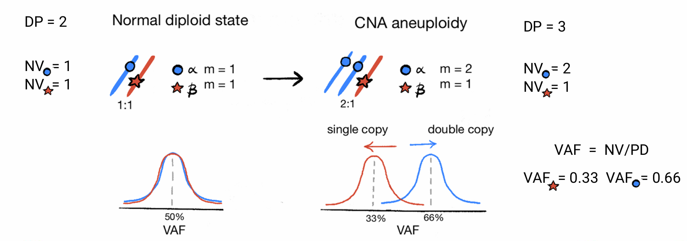

# tickTack

## Overview

`tickTack` requires as input a `CNAqc` object with attributes `cna`,
`mutations` and `metadata`. The main input for the tool are:

- the read counts from somatic mutations such as single-nucleotide
  variants (SNVs) in the mutation attribute;
- allele-specific copy number segments (CNAs) for clonal segments must
  be encoded in the cna attribute;
- a tumor purity estimate in the metadata.

The tool uses chromosome coordinates to map mutations to segments. The
conversion of relative to absolute genome coordinates requires to fix a
reference genome build; supported reference is GRCh38/hg17 that is also
supported in CNAqc.

`tickTack` can be used to:

- time the genomic segments affected by a Copy Number event, obtaining
  one clock per segment
- time multiple CNAs in a hierarchical fashion, identifying $K$ clocks
  that cluster some segemnts together.

The following concepts are used to infer copy number timing.

### VAF peaks

The point mutations that are present on the duplicated region are
duplicated in copy with the segment. Therefore we can use the proportion
of mutations happede before and after the Copy Number event
distinguishing between mutations in single copy and double copies.

  

Therefore, for a single segment the value of the clock associated with
the Copy Number event is obtained as a transformation from the
proportions of mutations in single and double copy. The following
quantities need to be considered:

  

In the case of a trisomy without LOH, we can consider the fact that,
before $\tau$, 1 chromosome will accumulate mutations that will
duplicate, while the other will accumulate mutations that will remain in
single copy. On the other hand, after $\tau$, both chromosomes will
accumulate mutations which will remain in single copy. Therefore one can
write the system:

$$\begin{array}{r}
\left\{ \begin{array}{l}
{N_{2} = \rho\tau N_{1} = \rho\tau + 3\rho(1 - \tau)}
\end{array} \right.
\end{array}$$

Using the first one to obtain $\rho$ and inserting into the second one,
the solution for $\tau$ becomes:

\$\$ N_1 = N_2 + \frac{3N_2}{\tau}(1-\tau) \hspace{2mm} \rightarrow
\hspace{2mm} N_1 + 2N_2 = \frac{3N_2}{\tau} \hspace{2mm} \rightarrow
\hspace{2mm} \tau = \frac{3N_2}{N_1 + 2N_2} \$\$

The case of the CNLOH and of the segment doubling can be treated
together. In fact, in the first case, before $\tau$ the mutations that
will duplicate accumulate on a single chromosome and after $\tau$ the
mutations that will remain in a single copy accumulate on two
chromosomes. The system therefore becomes:

$$\begin{array}{r}
\left\{ \begin{array}{l}
{N_{2} = \rho\tau N_{1} = 2\rho(1 - \tau)}
\end{array} \right.
\end{array}$$

A very similar things happens in the case of the 2:2, with the only
difference that the number of chromosomes accumulating a certain type of
mutation will be double, both after and before $\tau$. Hence, the system
becomes:

$$\begin{array}{r}
\left\{ \begin{array}{l}
{N_{2} = 2\rho\tau N_{1} = 4\rho(1 - \tau)}
\end{array} \right.
\end{array}$$

Therefore, the two system can be solved similarly (you can simply drop a
factor of 2 in the second case). The solution for $\tau$ easily becomes:

\$\$ N_1 = \frac{2N_2(1-\tau)}{\tau} \hspace{2mm} \rightarrow
\hspace{2mm} \tau(N_1 + 2N_2) = 2N_2 \hspace{2mm} \rightarrow
\hspace{2mm} \tau = \frac{2N_2}{2N_2 + N_1} \$\$

### Clonal CNAs

Consider:

- mutations sitting on a segment $nA:nB$;
- tumour purity $\pi$;
- a healthy diploid normal;

Since the proportion of all reads from the tumour is
$\pi\left( n_{A} + n_{B} \right)$, and from the normal is $2(1 - \pi)$.
Then, muations present in $m$ copies of the tumour genome should peak at
VAF value

$$v_{m}(c) = \frac{m\pi c}{2(1 - \pi) + \pi\left( n_{A} + n_{B} \right)}$$
