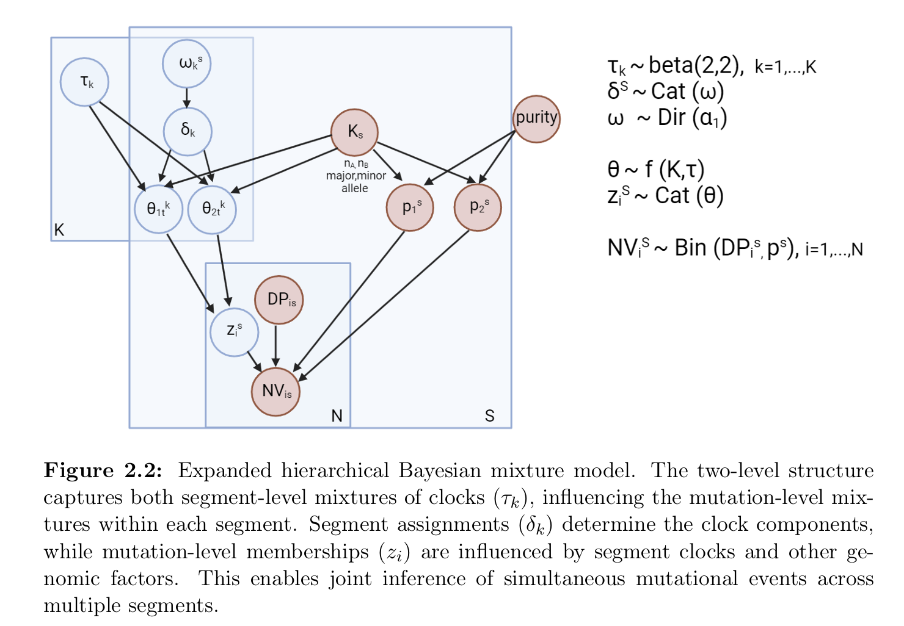

```{r, include = FALSE}
knitr::opts_chunk$set(
  collapse = TRUE,
  comment = "#>"
)

options(crayon.enabled=F)
```

## Overview

`tickTack` requires as input a `CNAqc` object with attributes `cna`, `mutations` and `metadata`. 
The main input for the tool are: 

- the read counts from somatic mutations such as single-nucleotide variants (SNVs) in the mutation attribute;
- allele-specific copy number segments (CNAs) for clonal segments must be encoded in the cna attribute;
- a tumor purity estimate in the metadata.

The tool uses chromosome coordinates to map mutations to segments. The conversion of relative to absolute genome coordinates requires to fix a reference genome build; supported reference is GRCh38/hg17 that is also supported in CNAqc. 

`tickTack` can be used to:

- time the genomic segments affected by a Copy Number event, obtaining one clock per segment
- time multiple CNAs in a hierarchical fashion, identifying $K$ clocks that cluster some segemnts together.

The following concepts are used to infer copy number timing.

### VAF peaks

The point mutations that are present on the duplicated region are duplicated in copy with the segment. Therefore we can use the proportion of mutations happede before and after the Copy Number event distinguishing between mutations in single copy and double copies.

<br>


Therefore, for a single segment the value of the clock associated with the Copy Number event is obtained as a transformation from the proportions of mutations in single and double copy.
The following quantities need to be considered:


\begin{itemize}
	\item $N_m$ : number of mutations with multiplicity $m$;
	\item $\rho$ : mutation rate, indicates how many mutations occur per unit of time;
	\item $\tau$ : pseudo-time;
\end{itemize}


<br>

\subsubsection{2:1}

In the case of a trisomy without LOH, we can consider the fact that, before $\tau$, 1 chromosome will accumulate mutations that will duplicate, while the other will accumulate mutations that will remain in single copy. On the other hand, after $\tau$, both chromosomes will accumulate mutations which will remain in single copy. Therefore one can write the system:

\begin{align}
    \begin{cases}
        N_2 = \rho \tau  
        N_1 = \rho \tau + 3\rho(1 - \tau) \nonumber 
    \end{cases}
\end{align}

Using the first one to obtain $\rho$ and inserting into the second one, the solution for $\tau$ becomes:

$$
	N_1 = N_2 + \frac{3N_2}{\tau}(1-\tau) \hspace{2mm} \rightarrow \hspace{2mm} N_1 + 2N_2 = \frac{3N_2}{\tau} \hspace{2mm} \rightarrow \hspace{2mm} \tau = \frac{3N_2}{N_1 + 2N_2}
$$

\subsubsection{2:0 and 2:2}

The case of the CNLOH and of the segment doubling can be treated together. In fact, in the first case, before $\tau$ the mutations that will duplicate accumulate on a single chromosome and after $\tau$ the mutations that will remain in a single copy accumulate on two chromosomes. The system therefore becomes:

\begin{align}
    \begin{cases}
        N_2 = \rho \tau  
        N_1 = 2\rho(1 - \tau) \nonumber 
    \end{cases}
\end{align}

A very similar things happens in the case of the 2:2, with the only difference that the number of chromosomes accumulating a certain type of mutation will be double, both after and before $\tau$. Hence, the system becomes:

\begin{align}
    \begin{cases}
        N_2 = 2\rho \tau  
        N_1 = 4\rho(1 - \tau) \nonumber 
    \end{cases}
\end{align} 

Therefore, the two system can be solved similarly (you can simply drop a factor of 2 in the second case). The solution for $\tau$ easily becomes:

$$
  N_1 = \frac{2N_2(1-\tau)}{\tau} \hspace{2mm} \rightarrow \hspace{2mm} \tau(N_1 + 2N_2) = 2N_2 \hspace{2mm} \rightarrow \hspace{2mm} \tau = \frac{2N_2}{2N_2 + N_1}
$$

### Clonal CNAs

Consider:

- mutations sitting on a segment $nA:nB$;
- tumour purity $\pi$;
- a healthy diploid normal;

Since the proportion of all reads from the tumour is $\pi(n_A+n_B)$, and from the normal is $2(1-\pi)$. Then, muations present in $m$ copies of the tumour genome should peak at VAF value 

$$
v_m(c) = \dfrac{m \pi c}{
2 (1 - \pi) + \pi (n_A+n_B)
}
$$


<!-- ## The model -->

<!-- <br> -->


<!-- Here we show an example of the model application on real data from the Pan-Cancer Analysis of -->
<!--  Whole Genomes (PCAWG) cohort, specifically from a Renal Cell Carcinoma (Kidney-RCC) tumor type sample.  -->


<!-- ```{r setup, warning=FALSE} -->
<!-- library(tickTack) -->
<!-- library(gridExtra) # add in plotting function -->
<!-- library(ggplot2) # add in plotting function -->
<!-- library(bayesplot) # add in plotting function -->
<!-- library(tibble)  # check if needed -->
<!-- library(dplyr) # check if needed -->

<!-- library(bayesplot) #for plotting -->
<!-- library(ggplot2) #for plotting -->
<!-- library(stringr) #for plotting -->
<!-- library(patchwork) #for plotting -->
<!-- ``` -->


<!-- ```{r real data Kidney, echo = T, results = 'hide', warning=FALSE} -->
<!-- # Load template data -->
<!-- tickTack::pcawg_example_2 -->
<!-- data <- pcawg_example_2 -->


<!-- tolerance <- 0.1 -->


<!-- data <- tickTack::fit_h(data, max_attempts=2, INIT=TRUE, tolerance = tolerance, n_components = 0) -->
<!-- results <- data$results_timing -->


<!-- clock_assignment <- results$draws_and_summary[[3]]$summarized_results -->

<!-- input_data <- results$data$input_data -->
<!-- draws_and_summary <- results$draws_and_summary -->
<!-- log_lik_matrix_list <- results$log_lik_matrix_list -->
<!-- elbo_iterations <- results$elbo_iterations -->


<!-- results_model_selection <- model_selection_h(input_data, draws_and_summary, log_lik_matrix_list, elbo_iterations, n_components = 0) -->


<!-- best_K <- results_model_selection$best_K -->
<!-- model_selection_tibble <- results_model_selection$model_selection_tibble -->
<!-- entropy <- results_model_selection$entropy_list -->


<!-- p <- tickTack::plot_timing_h(results, best_K) -->
<!-- p -->

<!-- ``` -->


<!-- ```{r visualize, echo = T, warning=FALSE, fig.align='center'} -->
<!-- # Visualize distributions of draws from the approximate posterior -->

<!-- K = nrow(results_model_selection$model_selection_tibble) -->
<!-- S = nrow(results$data$accepted_cna) -->


<!-- ``` -->


<!-- ```{r tau, echo = T, fig.align='center'} -->
<!-- # from bayesplot -->
<!-- draws <- results$draws_and_summary[[best_K]]$draws -->

<!-- names <- paste("tau[", 1:best_K, "]", sep = "") -->

<!-- areas_tau <- mcmc_areas( -->
<!-- draws, -->
<!-- pars = names, -->
<!-- prob = 0.8, # 80% intervals -->
<!-- prob_outer = 0.95, # 99% -->
<!-- point_est = "median" -->
<!-- )+ -->
<!-- labs( -->
<!-- title = "Approximate Posterior distributions", -->
<!-- subtitle = "With median and 80% and 95% intervals" -->
<!-- )+ -->
<!-- xlim(0, 1) # + scale_x_continuous(breaks = c(1:5), labels = c("A", "B", "C", "D", "E")) -->
<!-- areas_tau -->


<!-- ``` -->


<!-- ```{r weights, echo = T, fig.height = 6, fig.width = 12, fig.align = "center"} -->
<!-- # from bayesplot -->
<!-- intervals_weigths_per_tau <- list() -->
<!-- for (k in 1:best_K){ -->
<!--   names_weights <- paste("w[",1:S,",", k, "]", sep = "") -->
<!--   p <- mcmc_intervals(draws, pars = names_weights, point_est = "median", prob = 0.8, prob_outer = 0.95)+ -->
<!--     labs( -->
<!--     title =  str_wrap( paste0("Posterior distributions of the weigths for tau ",k), width = 30 + K + sqrt(S)), -->
<!--     subtitle = "With median and 80% and 95% intervals" -->
<!--     ) -->
<!--    intervals_weigths_per_tau[[k]] <- ggplotGrob(p) -->
<!-- } -->
<!-- p <- gridExtra::grid.arrange(grobs = intervals_weigths_per_tau, ncol= best_K) #add global title -->


<!-- ``` -->


<!-- ```{r source plot, include=TRUE} -->
<!-- source("./plotting_function.R", local = knitr::knit_global()) -->
<!-- ``` -->


<!-- ```{r elbo, echo = T, fig.height = 20, fig.width = 12, fig.align = "center"} -->

<!-- # visualize elbo -->
<!-- p_elbo <- list() -->
<!-- for (i in 1:K){ -->
<!--   p_elbo[[i]] <- plot_elbo(elbo_iterations, i) + ggtitle(paste0("K = ", i)) -->
<!--   saveRDS(p_elbo, paste0("./plots/elbo_vs_iterations_",i,".rds")) -->
<!-- } -->
<!-- p_elbo <- gridExtra::grid.arrange(grobs = p_elbo, nrow=K)  #add global title -->
<!-- p_elbo -->

<!-- ``` -->


<!-- ```{r model, echo = T, fig.height = 8, fig.width = 12, fig.align = "center"} -->

<!-- # visualize model selection scores -->

<!-- p_model_selection <- plotting_model_selection(model_selection_tibble, best_K, entropy) -->
<!-- p_model_selection -->

<!-- cat("Best K =",best_K) -->

<!-- ``` -->


<!-- ```{r plots, echo = T, fig.height = 18, fig.width = 12, fig.align = "center"} -->

<!-- plot_model_selection_inference <- list() -->
<!-- for (i in 1:K){ -->
<!--   plot_model_selection_inference[[i]] <- tickTack::plot_inference_h(results, i) + ggtitle(paste0("K = ", i)) -->
<!-- } -->
<!-- plot_model_selection_inference <- gridExtra::grid.arrange(grobs = plot_model_selection_inference, nrow=K) #add global title -->
<!-- plot_model_selection_inference -->

<!-- ``` -->


